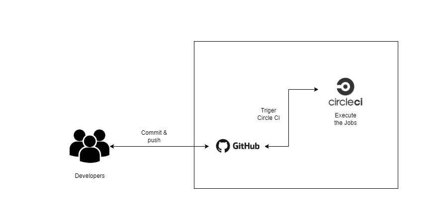


## Udagram Pipeline

### Continuous Integration
#### GitHub
The developers push and commit their code to the CircleCI platform-connected GitHub repository.
The CircleCI platform is triggered by GitHub whenever code is pushed to a repository.

#### CircleCI
CircleCI reads the `.circleci/config.yml` file which tells the service what has to be done. In the case of Udagram,
there are 2 jobs (build & deploy) to be run by CircleCI.
- **build**: install node and checkout code ,  install dependencies , Lint , Build
- **Server**: Install, build, deploy in both apps
