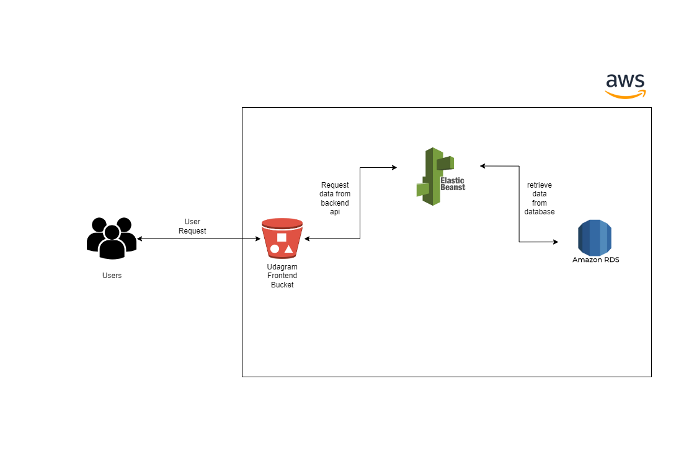


## Udagram Infrastructure

### AWS
#### RDS Postgres

The AWS RDS Postgres database is used by the application server to store and retrieve data.
Database URI: `udagramdb.c8mogl0jmwqk.us-east-1.rds.amazonaws.com`

#### Elastic Beanstalk
The AWS Elastic Beanstalk service is used to install the application server.
Elastic Beanstalk extracts the application and executes it on an endpoint after it is built, archived, and uploaded to an S3 bucket.
EB URL: `http://udagram-env.eba-m2yfnds5.us-east-1.elasticbeanstalk.com/api/v0`

#### S3 Bucket
AWS S3 Bucket is used to deploy the frontend application. The bundle of assets is uploaded to an S3 bucket, which is then made publicly accessible.

Bucket URL: `http://udagram-frontend-bucket.s3-website.us-east-2.amazonaws.com`

End users can access the application from the Bucket URL.
